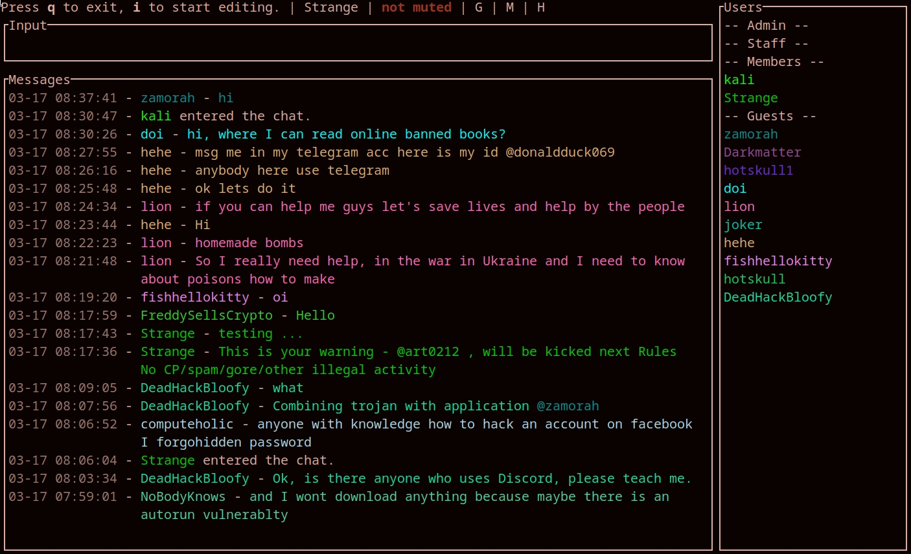

# BHCLI



## Description

This is a CLI client for any of [le-chat-php](https://github.com/DanWin/le-chat-php)  
Officially supported chats are [Black Hat Chat](http://blkhatjxlrvc5aevqzz5t6kxldayog6jlx5h7glnu44euzongl4fh5ad.onion)

Tested working on [ --url ] :
- [PopPooB's Chat](http://vfdvqflzfgwnejh6rrzjnuxvbnpgjr4ursv4moombwyauot5c2z6ebid.onion/chat.php)

## Pre-built binaries

Pre-buit binaries can be found on the [official website](http://git.dkforestseeaaq2dqz2uflmlsybvnq2irzn4ygyvu53oazyorednviid.onion/Strange/bhcli/releases)

## Features

- Sound notifications when tagged/pmmed
- Private messages `/pm username message`
- Kick someone `/kick username message` | `/k username message`
- Delete last message `/dl`
- Delete last X message `/dl5` will delete the last 5 messages
- Delete all messages `/dall`
- Ignore someone `/ignore username`
- Unignore someone `/unignore username`
- Ban a username and kick `/ban username`
- Ban a username exactly `/ban "username"`
- Filter messages containing text `/filter text`
- List banned usernames `/banlist`
- List exact banned usernames `/banexactlist`
- List filtered message terms `/filterlist`
- Unban a username `/unban username`
- Remove a message filter `/unfilter text`
- Toggle notifications sound `m`
- Toggle a "guest" view, by filtering out PMs and "Members chat" `shift+G`
- Toggle a "members" view, by filtering out PMs and "Guest chat" `shift+M`
- Filter messages `/f terms`
- Copy a selected message to clipboard `ctrl+C` | `y`
- Copy the first link in a message to clipboard `shift+Y`
- Directly tag author of selected message `t` will prefil the input with `@username `
- Directly private message author of selected message `p` will prefil the input with `/pm username `
- Shortcut to kick author of selected message `ctrl+k` will prefill with `/pm <master> #kick username` if a master account is set, otherwise `/kick username `
- Shortcut to ban author of selected message `ctrl+b` will prefill with `/pm <master> #ban username` if a master account is set, otherwise `/ban username `
- Use `ctrl+m` to prefill the input with `/pm <master> /m ` when a master account is set, or `/m ` when none is configured
- captcha is displayed directly in terminal 10 times the real size
- Upload file `/u C:\path\to\file.png @username message` (@username is optional) `@members` for members group
- `<tab>` to autocomplete usernames while typing
- `ctrl + w` or !warn username to send a pre-kick warning message to a user
  [ Only for members+ users ]
  > This is your warning @username, will be kicked next !rules
- Can hide messages with `backspace`, hidden messages can be viewed by toggling
  `ctrl+  H`. 
  > - Hidden messages are just hidden from the view, they are not deleted
  > - Deleted messages once hidden can't be viewed again
- Download an embedded file into cwd with `d`
- Download an embedded file and open it with xdg-open into cwd with `D`
- `shift + T` for translating text to english. [ must have translate-shell installed on arch or debain ]
    > pacman -S translate-shell
- Custom personal command creation for members+ [ read Command Creation ]
- Set alternate and master accounts per profile using `/set alt <username>` and `/set master <username>`

### Editing mode
- `ctrl+A` Move cursor to start of line
- `ctrl+E` Move cursor to end of line
- `ctrl+F` Move cursor a word forward
- `ctrl+B` Move cursor a word backward

### Messages navigation
- Page down the messages list `ctrl+D` | `page down`
- Page up the messages list `ctrl+U` | `page up`
- Going down 1 message `j` | `down arrow`
- Going down 5 message `J(CAPS)`
- Going up 1 message `k` | `up arrow`
- Going up 5 message `K(CAPS)`
- Jump to Top Message `gg`

## Build from source

### Windows

- Install C++ build tools https://visualstudio.microsoft.com/visual-cpp-build-tools/
- Install Rust https://www.rust-lang.org/learn/get-started
- Download & extract code source
- Compile with `cargo build --release`

### OSx

- Install Rust https://www.rust-lang.org/learn/get-started
- Compile with `cargo build --release`

### Linux

- Install Rust
- Install dependencies `apt-get install -y pkg-config libasound2-dev libssl-dev cmake libfreetype6-dev libexpat1-dev libxcb-composite0-dev libx11-dev`
- The manual way
> - Compile with `cargo build --release`
> - Run with `./target/release/bhcli`
> - You can move the binary to `/opt` to make it available system wide [ given that u have /opt in $PATH ]
- The MAKEFILE way
> - Compile with `make linux`
> - Run with bhcli [ given that u have /opt in $PATH ]
- The bhcli.log file will be created in the same directory as the pwd you run
  the binary from

## Cross compile

`cargo build --release --target x86_64-pc-windows-gnu`


## Profiles

To automatically login when starting the application, you can put the following content in your config file `/path/to/rs.bhcli/default-config.toml`

```toml
[profiles]

[profiles.default]
username = "username"
password = "password"
alt_account = "myAlt"
master_account = "myMain"
```
## Custom Commands

U can create ur own custom personal commands using the format below.<br> 
The commands are not created on the server but rather edited on clien tand sen
tot server.<br> 
Comands must start from "!" in the textbox, but "!" are not required in config.

```toml
[commands]

command1 = "This is the mesage that will be posted"
hello = "hello everyone !"
```

## Configuration file

The configuration is stored using `confy`. On Linux this is usually
`~/.config/bhcli/bhcli.toml`. You can edit this file to preload profiles,
create custom commands and maintain filters.

To manually add or remove banned usernames or message filters you can edit the
`bad_usernames`, `bad_exact_usernames` and `bad_messages` arrays in this file:

```toml
bad_usernames = ["spammer1", "spammer2"]
bad_exact_usernames = ["baduser"]
bad_messages = ["buy now", "free money"]
```

Filters modified using `/ban`, `/ban "name"`, `/filter`, `/unban` and `/unfilter` are saved
back to this file automatically and any custom commands in the `[commands]`
section are preserved.
