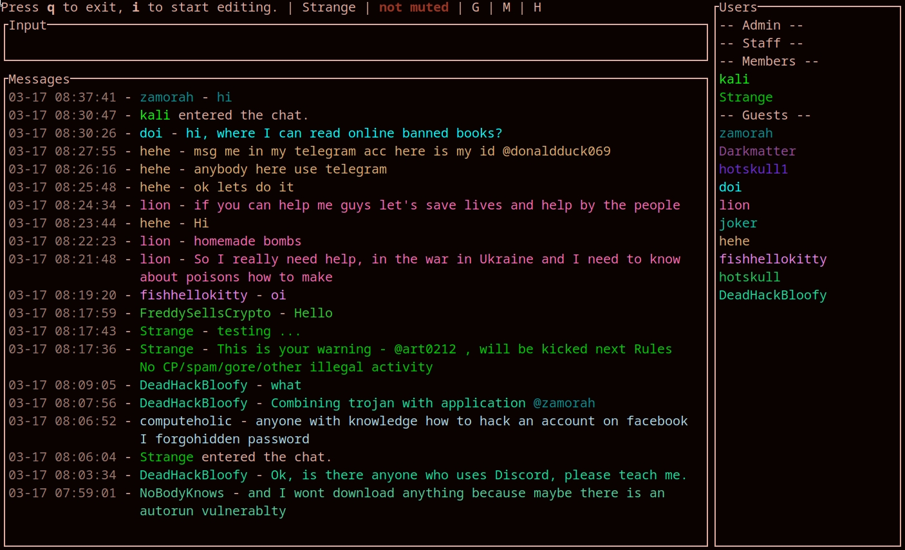

# BHCLI



## Description

This is a CLI client for any of [le-chat-php](https://github.com/DanWin/le-chat-php)
Officially supported chats are [Black Hat Chat](http://blkhatjxlrvc5aevqzz5t6kxldayog6jlx5h7glnu44euzongl4fh5ad.onion)

Tested working on [ --url ] :

- [PopPooB's Chat](http://vfdvqflzfgwnejh6rrzjnuxvbnpgjr4ursv4moombwyauot5c2z6ebid.onion/chat.php)

## Pre-built binaries

Pre-buit binaries can be found on the [official website](http://git.dkforestseeaaq2dqz2uflmlsybvnq2irzn4ygyvu53oazyorednviid.onion/Strange/bhcli/releases)

## Features

- **🤖 Advanced AI Integration**: Comprehensive AI-powered features including chat summarization, real-time language detection, sentiment analysis, intelligent moderation, and enhanced code review
- **🤖 Background Bot System**: Persistent memory bots with full chat history, user statistics, message search/recall, data export, and intelligent community management
- **ChatOps Integration**: 30+ developer-focused slash commands for documentation lookup, development tools, GitHub integration, network diagnostics, and AI assistance
- **🌐 Multi-language Support**: Automatic language detection and translation with 95%+ accuracy
- **📊 Chat Analytics**: Real-time atmosphere monitoring, sentiment tracking, and conversation insights
- **🛡️ Smart Moderation**: AI-powered content analysis with context-aware moderation suggestions
- Sound notifications when tagged/pmmed
- Private messages `/pm username message`
- Kick someone `/kick username message` | `/k username message` (Members +)
- Delete last message `/dl`
- Delete last X message `/dl5` will delete the last 5 messages
- Delete all messages `/dall`
- Ignore someone `/ignore username`
- Unignore someone `/unignore username`
- (Dasho) Ban a username and kick `/ban username` (Members +)
- (Dasho) Ban a username exactly `/ban "username"` (Members +)
- (Dasho) Filter messages containing text `/filter text` (Members +)
- (Dasho) List banned usernames `/banlist` (Members +)
- (Dasho) List exact banned usernames `/banexactlist` (Members +)
- (Dasho) List filtered message terms `/filterlist` (Members +)
- (Dasho) Unban a username `/unban username` (Members +)
- (Dasho) Remove a message filter `/unfilter text` (Members +)
- Toggle notifications sound `m`
- Toggle a "guest" view, by filtering out PMs and "Members chat" `shift+G`
- Toggle a "members" view, by filtering out PMs and "Guest chat" `shift+M`
- Filter messages `/f terms`
- Copy a selected message to clipboard `ctrl+C` | `y`
- Copy the first link in a message to clipboard `shift+Y`
- Directly tag author of selected message `t` will prefil the input with `@username `
- Directly private message author of selected message `p` will prefil the input with `/pm username `
- (Dasho) Shortcut to kick author of selected message `ctrl+k` will prefill with `/pm <master> #kick username` if a master account is set, otherwise `/kick username `
- (Dasho) Shortcut to ban author of selected message `ctrl+b` will prefill with `/pm <master> #ban username` if a master account is set, otherwise `/ban username ` (Again, only useful for members+ users)
- (Dasho) Use `ctrl+a` to prefill the input with `/pm <master> /m ` when a master account is set, or `/m ` when none is configured (Again, only useful for members+ users)
- captcha is displayed directly in terminal 10 times the real size
- Upload file `/u C:\path\to\file.png @username message` (@username is optional) `@members` for members group
- `<tab>` to autocomplete usernames while typing
- `ctrl + w` or !warn username to send a pre-kick warning message to a user
  [ Only for members+ users ]
  > This is your warning @username, will be kicked next !rules
- Can hide messages with `backspace`, hidden messages can be viewed by toggling
  `ctrl+  H`.
  > - Hidden messages are just hidden from the view, they are not deleted
  > - Deleted messages once hidden can't be viewed again
- Download an embedded file into cwd with `d`
- Download an embedded file and open it with xdg-open into cwd with `D`
- `shift + T` for translating text to english. [ must have translate-shell installed on arch or debain ]
  > pacman -S translate-shell
- Custom personal command creation for members+ [ read Command Creation ]
- Set alternate and master accounts per profile using `/set alt <username>` and `/set master <username>`

## ChatOps Commands

BHCLI includes a comprehensive ChatOps system with 30+ developer-focused commands across multiple categories. These commands provide quick access to documentation, development tools, network diagnostics, and integrations.

### 📖 Documentation & Lookup Commands

Get instant access to documentation and references:

- `/help` - Show all available ChatOps commands with descriptions
- `/man <command>` - Display manual pages for system commands (e.g., `/man curl`)
- `/doc <language> <term>` - Language-specific documentation lookup (e.g., `/doc rust HashMap`)
- `/explain <concept>` - AI-powered explanations of programming concepts
- `/cheat <tool>` - Quick reference cheatsheets for common tools
- `/stackoverflow <query>` - Search Stack Overflow for programming questions
- `/ref <language>` - Quick access to language reference documentation

### 🔧 Tooling & Utilities Commands

Essential development utilities and tools:

- `/hash <algorithm> <text>` - Generate cryptographic hashes (MD5, SHA1, SHA256, SHA512)
  - Example: `/hash sha256 hello world`
- `/uuid` - Generate a new UUID v4
- `/base64 <encode|decode> <text>` - Base64 encoding and decoding
  - Example: `/base64 encode "hello world"`
- `/regex <pattern> <text>` - Test regular expressions and see matches
  - Example: `/regex "\d+" "abc 123 def"`
- `/whois <domain>` - Domain WHOIS lookup for registration information
- `/dig <domain>` - DNS record lookup and resolution
- `/ipinfo <ip>` - Get detailed information about IP addresses
- `/rand <min> <max>` - Generate random numbers within range
- `/time` - Display current timestamp and timezone information

### 💬 Chat Linking & Session Intelligence

Enhanced chat functionality and user management:

- `/chatlink <message_id>` - Create shareable links to specific chat messages
- `/quote <user> <message>` - Quote and reference messages from other users
- `/rooms` - List all available chat rooms and their status
- `/whereis <user>` - Find which rooms a user is currently in

### 🤖 AI Integration Commands

Leverage AI for development assistance:

- `/summarize <text>` - AI-powered text summarization
- `/translate <language> <text>` - Translate text between languages
- `/fix <code>` - Get AI suggestions for fixing code issues
- `/review <code>` - AI-powered code quality review and suggestions

### 🐙 GitHub & Package Management

Repository and package information at your fingertips:

#### GitHub Integration

- `/github <user/repo>` (alias: `/gh`) - Get repository information and links
  - `/github user/repo` - Show basic repository info
  - `/github user/repo issues` - Direct link to issues
  - `/github user/repo latest` - Link to latest release
  - `/github user/repo file <path>` - Link to specific file
- `/gist <code>` - Create GitHub Gists (requires GitHub CLI authentication)

#### Package Managers

- `/crates <crate_name>` - Rust crate information from crates.io
- `/npm <package_name>` - NPM package information and installation commands
- `/pip <package_name>` (alias: `/pypi`) - Python package info from PyPI

### 🌐 Network Diagnostics

Network troubleshooting and connectivity tools:

- `/ping <host>` - Test network connectivity and response times
- `/traceroute <host>` - Trace network path to destination
- `/nslookup <domain>` - DNS name resolution and record lookup
- `/netstat` - Display active network connections and listening ports

### ⚙️ Miscellaneous Commands

Additional utility commands:

- `/alias <name> <command>` - Create personal command aliases
  - `/alias list` - Show all your aliases
  - `/alias remove <name>` - Remove an alias
- `/version` - Display BHCLI version and system information

### Command Usage Examples

```bash
# Documentation lookups
/help                           # Show all commands
/man grep                       # Manual page for grep
/doc rust Vec                   # Rust documentation for Vec

# Development tools
/hash sha256 "my secret"        # Generate SHA256 hash
/uuid                           # Generate new UUID
/base64 encode "hello world"    # Base64 encode text
/regex "\d+" "abc 123 def"      # Test regex pattern

# GitHub integration
/github rust-lang/rust          # Get Rust repository info
/github microsoft/vscode issues # Link to VS Code issues
/crates serde                   # Info about serde crate
/npm express                    # Info about Express.js package

# Network diagnostics
/ping google.com                # Ping Google
/dig example.com                # DNS lookup
/whois github.com               # Domain registration info

# AI assistance
/translate spanish "Hello world" # Translate to Spanish
/summarize "long text here..."    # Summarize text
/fix "broken code here"           # Get code fix suggestions
```

### Command Permissions

ChatOps commands respect user roles and permissions:

- **Guest**: Access to documentation, basic tools, and read-only commands
- **Member**: Full access to all ChatOps commands
- **Staff/Admin**: Complete access plus any future administrative commands

### Command Help System

Each command includes built-in help:

- Use `/help` to see all available commands
- Use `/help <command>` to get detailed usage information for specific commands
- Commands show usage hints when used incorrectly

### Extending ChatOps

The ChatOps system is built with extensibility in mind. New commands can be easily added by implementing the `ChatCommand` trait. The modular architecture supports:

- Custom command categories
- Alias support for commands
- Role-based permission checking
- Structured result formatting
- Error handling and user feedback

### Editing mode

- `ctrl+A` Move cursor to start of line
- `ctrl+E` Move cursor to end of line
- `ctrl+F` Move cursor a word forward
- `ctrl+B` Move cursor a word backward
- `ctrl+.`, `ctrl+X`, or `ctrl+O` Open external editor (nvim/vim/nano) - automatically sends message after editing
- `ctrl+L` Toggle multiline input mode (in multiline mode, use `ctrl+Enter` to send, `Enter` for newline)
- `Up/Down arrows` Navigate through command history (filters by current input prefix)

### Multiline Input Mode

- `Enter` Insert newline
- `ctrl+Enter` Send message
- `ctrl+L` Toggle back to single-line mode
- `Up/Down arrows` Navigate through command history
- `Escape` Exit to normal mode

### Messages navigation

- Page down the messages list `ctrl+D` | `page down`
- Page up the messages list `ctrl+U` | `page up`
- Going down 1 message `j` | `down arrow`
- Going down 5 message `J(CAPS)`
- Going up 1 message `k` | `up arrow`
- Going up 5 message `K(CAPS)`
- Jump to Top Message `gg`

## Build from source

### Windows

- Install C++ build tools https://visualstudio.microsoft.com/visual-cpp-build-tools/
- Install Rust https://www.rust-lang.org/learn/get-started
- Download & extract code source
- Compile with `cargo build --release`

### OSx

- Install Rust https://www.rust-lang.org/learn/get-started
- Compile with `cargo build --release`

### Linux

- Install Rust
- Install dependencies `apt-get install -y pkg-config libasound2-dev libssl-dev cmake libfreetype6-dev libexpat1-dev libxcb-composite0-dev libx11-dev`
- The manual way
  > - Compile with `cargo build --release`
  > - Run with `./target/release/bhcli`
  > - You can move the binary to `/opt` to make it available system wide [ given that u have /opt in $PATH ]
- The MAKEFILE way
  > - Compile with `make linux`
  > - Run with bhcli [ given that u have /opt in $PATH ]
- The bhcli.log file will be created in the same directory as the pwd you run
  the binary from

## Cross compile

`cargo build --release --target x86_64-pc-windows-gnu`

## Profiles

To automatically login when starting the application, you can put the following content in your config file `/path/to/rs.bhcli/default-config.toml`

```toml
[profiles]

[profiles.default]
username = "username"
password = "password"
alt_account = "myAlt" # Optional, only for members+ (Dasho)
master_account = "myMain" # Optional, only for members+ (Dasho)
```

## Custom Commands

U can create ur own custom personal commands using the format below.<br>
The commands are not created on the server but rather edited on clien tand sen
tot server.<br>
Comands must start from "!" in the textbox, but "!" are not required in config.

```toml
[commands]

command1 = "This is the mesage that will be posted"
hello = "hello everyone !"
```

## Configuration file

The configuration is stored using `confy`. On Linux this is usually
`~/.config/bhcli/bhcli.toml`. You can edit this file to preload profiles,
create custom commands and maintain filters.

For members+ users, you can set the `alt_account` and `master_account` fields in the config file. (Dasho)
To manually add or remove banned usernames or message filters you can edit the
`bad_usernames`, `bad_exact_usernames` and `bad_messages` arrays in this file:

```toml
bad_usernames = ["spammer1", "spammer2"]
bad_exact_usernames = ["baduser"]
bad_messages = ["buy now", "free money"]
```

Filters modified using `/ban`, `/ban "name"`, `/filter`, `/unban` and `/unfilter` are saved
back to this file automatically and any custom commands in the `[commands]`
section are preserved.

## Command Line Arguments

BHCLI supports various command-line arguments for configuration and customization:

### Authentication & Profile

- `-u, --username <USERNAME>` - Set username (can also use `BHC_USERNAME` env var)
- `-p, --password <PASSWORD>` - Set password (can also use `BHC_PASSWORD` env var)
- `-c, --profile <PROFILE>` - Select configuration profile (default: "default")
- `--session <SESSION>` - Use existing session ID to skip login

### Connection & Network

- `--url <URL>` - Override chat server URL
- `--page-php <PAGE>` - Override chat page filename (default: chat.php)
- `-s, --socks-proxy-url <URL>` - SOCKS proxy URL (default: socks5h://127.0.0.1:9050, can use `BHC_PROXY_URL` env var)
- `--no-proxy` - Disable proxy usage
- `-r, --refresh-rate <SECONDS>` - Message refresh rate in seconds (default: 5, can use `BHC_REFRESH_RATE` env var)
- `--datetime-fmt <FORMAT>` - Override datetime format
- `--members-tag <TAG>` - Override members tag format

### Display & Behavior

- `-g, --guest-color <COLOR>` - Set guest color theme
- `-m, --manual-captcha` - Enable manual captcha solving (can also use `BHC_MANUAL_CAPTCHA` env var)
- `-r, --refresh-rate <SECONDS>` - Message refresh rate in seconds (default: 5, can use `BHC_REFRESH_RATE` env var)
- `--datetime-fmt <FORMAT>` - Custom datetime format string
- `--sxiv` - Enable sxiv image viewer integration

### Bot System

- `--bot <NAME>` - Enable background bot with specified name (uses same credentials as main client)
- `--bot-admins <USER1,USER2>` - Comma-separated list of bot administrators
- `--bot-data-dir <PATH>` - Custom directory for bot data storage (default: `bot_data/{botname}`)

### Integrations

- `--dkf-api-key <KEY>` - DKF API key for notifications (can also use `DKF_API_KEY` env var)
- `--dnmx-username <USERNAME>` - DNMX email username (can also use `DNMX_USERNAME` env var)
- `--dnmx-password <PASSWORD>` - DNMX email password (can also use `DNMX_PASSWORD` env var)

### Advanced Options

- `-d, --dan` - Enable special DAN mode features
- `--keepalive-send-to <TARGET>` - Override keepalive message target (default: "0")

### Usage Examples

```bash
# Basic usage with username and password
bhcli -u myusername -p mypassword

# Use a specific profile
bhcli -c myprofile

# Connect through different proxy
bhcli -s socks5h://127.0.0.1:9150

# Disable proxy completely
bhcli --no-proxy

# Use custom refresh rate
bhcli -r 3

# Connect to different chat server
bhcli --url "http://example.onion" --page-php "chat.php"

# Enable manual captcha solving
bhcli -m

# Use environment variables
export BHC_USERNAME="myuser"
export BHC_PASSWORD="mypass"
export BHC_PROXY_URL="socks5h://127.0.0.1:9150"
bhcli
```

Most settings can be configured via environment variables or saved in the configuration file for persistent use across sessions.

## Changelog

### Recent Updates (September 2025)

#### 🤖 Advanced AI Service Integration

- **Comprehensive AI Service**: New `ai_service.rs` module with intelligent chat analysis
- **Real-time Message Tracking**: Automatic message history for context-aware AI responses
- **Smart Caching System**: Language detection and sentiment analysis caching for performance
- **Fallback Systems**: Graceful degradation when AI services are unavailable

#### 🤖 Background Bot System

- **Persistent Memory Bots**: Full chat history storage with perfect recall capabilities
- **User Analytics Engine**: Comprehensive user statistics, activity patterns, and behavioral analysis
- **Message Search & Recall**: Find any message instantly by timestamp, content, or user
- **Data Export System**: Research-ready chat archives in multiple formats
- **Message Restoration**: Recover accidentally deleted messages from bot memory
- **AI-Enhanced Analysis**: Intelligent chat summaries, mood analysis, and content insights
- **Admin Command Suite**: Advanced moderation tools and user management features

#### 🌐 Multi-language & Translation Features

- **Language Detection**: Real-time detection with confidence scoring and ISO codes
- **Advanced Translation**: AI-powered translation with fallback to system tools
- **Multi-language Chat Support**: Seamless communication across language barriers

#### 📊 Chat Analytics & Insights

- **Chat Summarization**: Intelligent conversation summaries with key points and participant analysis
- **Atmosphere Monitoring**: Real-time chat mood and activity level tracking
- **Sentiment Analysis**: Emotional tone detection with confidence ratings and emotion categorization

#### 🛡️ Enhanced AI Moderation

- **Context-aware Analysis**: AI moderation that understands conversation context
- **Severity Scoring**: 0-10 scale moderation recommendations with confidence ratings
- **Smart Action Suggestions**: Intelligent recommendations for moderation actions (warn/kick/ban)
- **Integration with Existing Systems**: Seamless integration with current moderation tools

#### 💻 Enhanced Developer Experience

- **Comprehensive Code Review**: AI-powered code analysis with security, performance, and quality insights
- **Language-specific Suggestions**: Targeted advice for Rust, Python, JavaScript, and more
- **ChatOps Command Expansion**: New AI commands integrated into existing ChatOps framework

### Previous Updates (August 2025)

#### AI Moderation System

- **Added AI-powered moderation** with OpenAI integration for automated content filtering
- **Guest-only moderation**: AI moderation only applies to guests, members/staff/admins are exempt
- **Multi-layered protection**: Quick pattern matching + AI analysis for comprehensive coverage
- **AI conversation modes**:
  - `/ai off` - Completely disable AI
  - `/ai mod` - Enable moderation only
  - `/ai reply all` - Enable replies to all messages + moderation
  - `/ai reply ping` - Enable replies only when tagged + moderation
- **Moderation strictness levels**: `/ai strict`, `/ai balanced`, `/ai lenient`
- **Enhanced pattern detection**: Comprehensive quick patterns for immediate filtering of inappropriate content
- **AI testing commands**: `/check ai` for system status, `/check mod <message>` to test moderation

#### Moderation Logging System

- **Added `/modlog on/off`** - Toggle moderation logging to admin channel (@0)
- **Detailed mod logs**: Track all moderation decisions, pattern matches, and AI analysis
- **Configurable logging**: Per-profile mod log settings saved to config

#### Message Threading & Performance

- **Per-message threading**: Each message now sends in its own thread to eliminate race conditions
- **Concurrent message processing**: User messages and system messages (AI, moderation) no longer block each other
- **Non-blocking channel operations**: Prevents deadlocks and improves responsiveness
- **Better concurrent handling**: Multiple messages can be sent simultaneously without interference

#### Enhanced Content Filtering

- **Expanded quick patterns**: Added comprehensive detection for inappropriate content involving minors
- **Improved spam detection**: Better recognition of repetitive/spam content
- **Allowlist bypass**: Allowlisted users bypass all content filters
- **Separated AI functions**: AI moderation and conversational AI now use different prompts for better accuracy

#### Technical Improvements

- **Thread-safe message sending**: All message operations now use dedicated threads
- **Improved error handling**: Better channel error management with try_send patterns
- **Enhanced logging**: More detailed moderation and system logs

## 🤖 Bot System

BHCLI now includes a powerful background bot system that runs alongside your main chat client, providing persistent memory and intelligent community management features.

### Quick Start

```bash
# Start BHCLI with a bot named "Assistant"
./target/release/bhcli --bot Assistant

# Start with admin users
./target/release/bhcli --bot Assistant --bot-admins alice,bob

# Custom data directory
./target/release/bhcli --bot Assistant --bot-data-dir /custom/path
```

### Bot Commands

Interact with your bot by mentioning it:

```
@Assistant help                     # Get list of available commands
@Assistant stats alice              # View user statistics
@Assistant recall 14:30             # Find message from 14:30 today
@Assistant search "rust error"      # Search message history
@Assistant export alice 7           # Export alice's messages (7 days)
@Assistant restore 12345            # Restore deleted message
@Assistant summary 24               # Chat activity summary (24 hours)
@Assistant users                    # List current online users
@Assistant top messages             # Top users by message count
```

### Key Features

- **Perfect Memory**: Never lose important conversations - bot remembers everything
- **Powerful Search**: Find any message instantly by content, user, or timestamp
- **User Analytics**: Detailed statistics on user activity, behavior, and patterns
- **Data Export**: Generate research-ready chat archives and reports
- **Message Recovery**: Restore accidentally deleted messages from bot's memory
- **AI Integration**: Enhanced analysis when OPENAI_API_KEY is configured
- **Admin Tools**: Advanced moderation and user management features

### Data Storage

Bot data is automatically saved to `bot_data/{botname}/` with:

- Complete message history (`message_history.json`)
- User statistics database (`user_stats.json`)
- Generated export files (`exports/` directory)

For detailed documentation, see `BOT_SYSTEM.md`

- **Configuration persistence**: AI settings and mod log preferences saved per profile

These updates significantly improve the chat moderation capabilities while maintaining performance and preventing race conditions in message handling.
