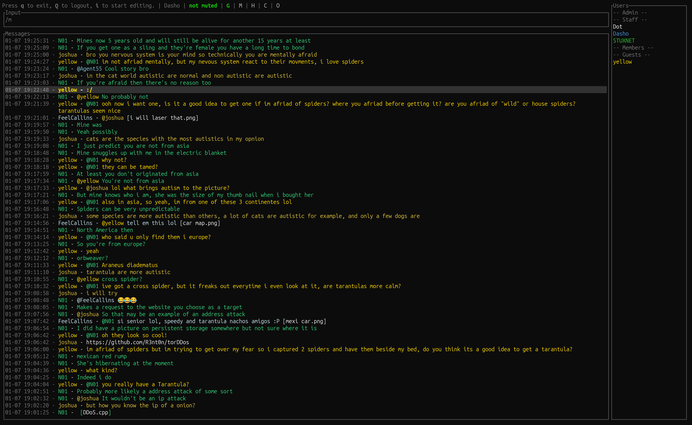

# BHCLI



A sophisticated terminal client for le-chat-php based chat systems. Built for the darknet, optimized for Tor, works everywhere.

## What is this?

BHCLI is a CLI chat client designed for anonymous communication over Tor. It connects to any [le-chat-php](https://github.com/DanWin/le-chat-php) chat server with full feature parity plus advanced capabilities like AI integration, bot automation, and developer tools.

**Officially supported:**
- [404 Chatroom Not Found](http://4o4o4hn4hsujpnbsso7tqigujuokafxys62thulbk2k3mf46vq22qfqd.onion/chat/min)
- [Black Hat Chat](http://blkhatjxlrvc5aevqzz5t6kxldayog6jlx5h7glnu44euzongl4fh5ad.onion)
- [PopPooB's Chat](http://vfdvqflzfgwnejh6rrzjnuxvbnpgjr4ursv4moombwyauot5c2z6ebid.onion/chat.php)

## Getting Started

### Quick Install

**Pre-built binaries:**
```bash
# Download from latest release
https://github.com/d-a-s-h-o/bhcli/releases/latest
```

**Build from source:**
```bash
# Install Rust if you don't have it
curl --proto '=https' --tlsv1.2 -sSf https://sh.rustup.rs | sh

# Clone and build
git clone <repo>
cd bhcli
cargo build --release

# Binary will be at target/release/bhcli
```

**Linux dependencies:**
```bash
apt-get install -y pkg-config libasound2-dev libssl-dev cmake libfreetype6-dev libexpat1-dev libxcb-composite0-dev libx11-dev
```

### First Run

```bash
# Just run it, it will prompt you
./bhcli

# Or specify credentials
./bhcli -u yourusername -p yourpassword

# Through Tor (default)
./bhcli -s socks5h://127.0.0.1:9050

# Direct connection (not recommended for darknet chats)
./bhcli --no-proxy
```

On first run, a man page gets installed automatically. Access it with `man bhcli` anytime.

## Core Features

### The Basics

- **Private messaging** with `/pm username message`
- **Sound notifications** when tagged or PM'd (can be disabled with `m`)
- **File uploads** with `/u /path/to/file.png @username optional message`
- **Captcha rendering** directly in terminal at 10x size
- **Tab completion** for usernames
- **Message history** with up/down arrows
- **Copy to clipboard** with `ctrl+c` or `y`

### Views and Filters

Toggle between different chat views:
- `shift+G` for guest view (filter out members chat and PMs)
- `shift+M` for members view (filter out guest chat and PMs)
- `/f terms` to filter messages by content
- `/ignore username` to hide someone's messages
- `backspace` to hide individual messages, `ctrl+H` to view hidden ones

### Message Navigation

```
j / down arrow    Move down one message
k / up arrow      Move up one message
J (shift)         Jump down 5 messages
K (shift)         Jump up 5 messages
gg               Jump to top
ctrl+d           Page down
ctrl+u           Page up
```

### Quick Actions

```
t                Tag author of selected message (@username)
p                Start PM to author (/pm username)
y                Copy selected message
shift+Y          Copy first link in message
d                Download embedded file
D                Download and open file
```

## Power Features

### ChatOps Commands (30+ tools)

BHCLI includes a full developer toolbox accessible via slash commands:

```bash
/help                    List all ChatOps commands
/man curl               System manual pages
/doc rust HashMap       Language documentation
/hash sha256 text       Cryptographic hashing
/uuid                   Generate UUIDs
/base64 encode data     Encoding utilities
/github user/repo       Repository info
/ping google.com        Network diagnostics
/translate spanish Hi   AI translation
```

See `MANUAL.md` or `man bhcli` for the complete command reference.

### AI Integration

When `OPENAI_API_KEY` is set:
- **Real-time translation** across 100+ languages
- **Sentiment analysis** of conversations
- **Code review** and debugging assistance
- **Chat summarization** and insights
- **Smart moderation** (configurable strictness)

Control AI features:
```bash
/ai off              Disable AI completely
/ai mod              Moderation only
/ai reply all        Reply to all messages
/ai reply ping       Reply when mentioned
/ai strict           Strict moderation
/ai balanced         Balanced moderation (default)
/ai lenient          Lenient moderation
```

### Background Bot System

Run a persistent bot alongside your client:
```bash
./bhcli --bot BotName --bot-admins alice,bob
```

Bots provide:
- **Perfect memory** of all chat history
- **Message search** and recall
- **User statistics** and analytics
- **Data export** capabilities
- **Message restoration** for deleted content

Interact with bots by mentioning them:
```
@BotName help
@BotName stats alice
@BotName search "rust error"
@BotName recall 14:30
@BotName export alice 7
```

## Configuration

### Profiles

Store credentials in `~/.config/bhcli/bhcli.toml`:

```toml
[profiles]

[profiles.default]
username = "yourusername"
password = "yourpassword"

[profiles.work]
username = "workaccount"
password = "differentpassword"
```

Switch profiles with `bhcli -c work`

### Custom Commands

Create personal shortcuts:

```toml
[commands]
hello = "hey everyone, how's it going?"
afk = "stepping away for a bit, ping me if needed"
rules = "1. Be cool 2. No spam 3. Stay anonymous"
```

Use them by typing `!hello`, `!afk`, etc.

### Environment Variables

```bash
export BHC_USERNAME="myuser"
export BHC_PASSWORD="mypass"
export BHC_PROXY_URL="socks5h://127.0.0.1:9050"
export OPENAI_API_KEY="sk-..."  # For AI features
```

## Advanced Usage

### Editing Mode

The input bar supports Vim-like editing:

```
ctrl+a           Start of line
ctrl+e           End of line
ctrl+f           Word forward
ctrl+b           Word backward
ctrl+l           Toggle multiline mode
ctrl+.           Open external editor (nvim/vim/nano)
```

In multiline mode, `enter` adds newlines, `ctrl+enter` sends.

### Moderation Tools (Members+)

For moderators and admins:
```bash
/kick username reason       Boot someone
/ban username              Ban user (fuzzy match)
/ban "exact username"      Ban exact match
/filter spamtext           Auto-filter messages
/banlist                   Show banned users
/filterlist                Show filtered terms
/unban username            Remove ban
/unfilter text             Remove filter
```

Quick keyboard shortcuts:
```
ctrl+k           Prefill kick command for selected message
ctrl+b           Prefill ban command
ctrl+a           Prefill members group message
ctrl+w           Send warning message
```

### Multiple Accounts (Members+)

Link alt and master accounts for delegation:
```bash
/set alt AltAccountName
/set master MasterAccountName
```

This enables command forwarding and cross-account operations.

## Building and Distribution

### Standard Build

```bash
make build          # Debug build
make release        # Optimized release
make test           # Run tests
make check          # Quick compile check
```

### Cross-Platform

```bash
make build-linux-musl      # Static Linux binary
make build-macos           # macOS binary
make build-windows         # Windows binary
make build-all             # All platforms
```

### Optional Features

```bash
# Build without audio (for headless servers)
make build-no-audio

# Or with cargo directly
cargo build --release --no-default-features
```

## Documentation

- `MANUAL.md` for detailed guides and full command reference
- `man bhcli` for quick terminal reference (installed on first run)
- `OPTIMIZATION_REPORT.md` for technical details and performance info

## Performance Notes

BHCLI is optimized for low resource usage:
- **500ms tick rate** keeps CPU usage minimal
- **Optional audio** works on headless systems
- **Lazy loading** defers expensive operations
- **LTO and strip** produces compact binaries (~28MB release)

No fan spin-up, no excessive polling, just efficient terminal communication.

## Contributing

Built with Rust 2021 edition. Clean codebase, zero compiler warnings, comprehensive error handling. Pull requests welcome.

**Development:**
```bash
make fmt            # Format code
make clippy         # Run linter
make check          # Fast compilation check
cargo doc --open    # Generate and view docs
```

## Security Notes

BHCLI is designed for anonymous communication:
- **Tor-first** architecture with SOCKS5 support
- **No telemetry** or external phone-home
- **Local storage** only (config and bot data)
- **Optional features** minimize attack surface

For darknet usage, always route through Tor. Never use `--no-proxy` with .onion addresses unless you know what you're doing.

## License

MIT
See `LICENSE.md` file for details.